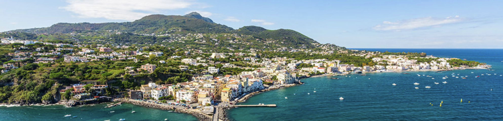

Welcome to the 2025 Summer School and Hackathon. The event will be organized in the beautiful Ischia, Summer 2025.

### PhD School on Modern Bioinformatics towards Pangenomics

The school is for researchers interested in broad topics of Bioinformatics, 
with a focus on Pangenomics and modern advances of in sequencing and data analysis.

The topics of the school are: 
- Introduction to Bioinformatics Services in Pangenomics and Cancer Genomics. 
- Introduction to modern genome sequence technologies, data analysis and software tools in genome structural variations 
- Structural variations in diseases, mapping copy number variation by genome sequencing 
- Latest trend methods and experimental validation
- Research challenges and entrepreneurship
- How to disseminate results to the scientific biomedical community.

### Hackathon: From one genome to many
There will also be an hackathon on genomics, proteomics and bioinformatics to get your hands dirty!
- Analysis of Structural Variations
- Free and Open software in Bioinformatics
- Reproducibility of results

*More detailed topics will be available soon*

### Registration
Registrations are now open [here](https://app.formbricks.com/s/cm9l760pp6q6zw201zm8tjh7g).

<!-- ### Partners -->
<!--  -->
<!--  -->
<!--  -->

The Forgenom II project has received funding from the Horizon Europe program under grant agreement No. 101160008. 

The school is a joint event with Pangaia --- Pangenome Graph Algorithms and Data Integration. The Pangaia project has received funding from the European Union’s Horizon 2020 Research and Innovation Staff Exchange programme under the Marie Skłodowska-Curie grant agreement No. 872539
